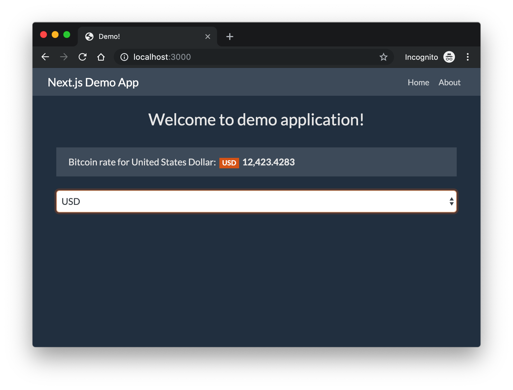

# nextjs-demo
Simple page created with next.js framework.

## Table of contents
* [General info](#general-info)
* [Technologies](#technologies)
* [Features](#features)
* [Screenshots](#screenshots)
* [Setup](#setup)
* [Status](#status)
* [Inspiration](#inspiration)
* [Todo](#todo)
* [License](#license)

## General info
Goal of project is to learn how to use next.js and create simple application in this framework.

## Technologies
* [Next.js](https://nextjs.org/)
* [React](https://reactjs.org/)
* [Bootstrap](https://getbootstrap.com/)

## Features
* Use external API to get bitcoin price
* Show bitcoin price
* Change currency

## Screenshots

## Setup
How to run this project.

1. Clone this repo

2. To run, go to project folder and run

`$ npm install`

3. Now start dev server by running -

`$ npm run dev`

4. visit - http://localhost:3000/

To create production ready codes -

`$ npm run build`

for more commands refer `package.json`

## Status
Project is finished.

## License
MIT
